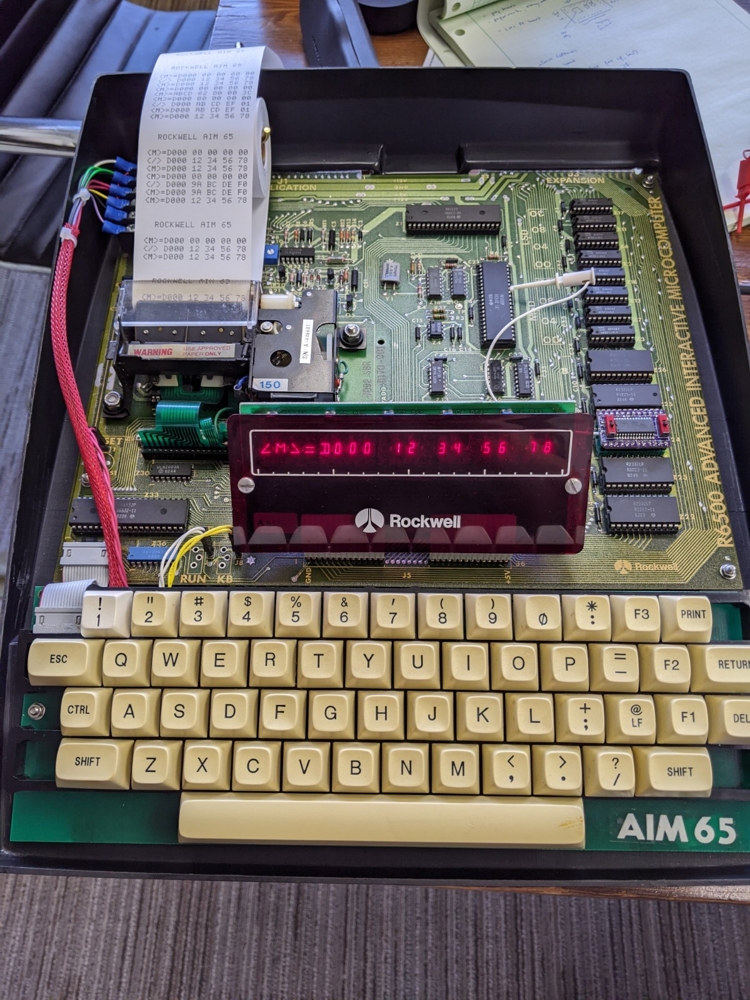
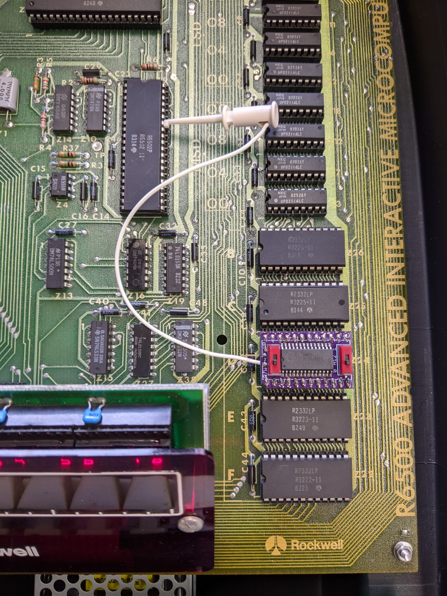

# AIM-65-FRAM

Nonvolatile FRAM memory replacement for 2332 ROM used by the Rockwell AIM-65.

<a href="https://oshpark.com/shared_projects/X4W64rqJ"></img></a>

  
  

This board plugs into any of the 5 2332 AIM-65 ROM sockets. 
A lead to the 6502 R/W signal is needed for writing to the FRAM.

A Write Protect switch allows disconnecting the R/W signal so that the FRAM truly behaves like a ROM.

The FRAM is 8KB, and the 2332 is only 4KB. A switch selects whether A12 is pulled high or low, giving 2 banks of 4KB. 
A12 may also be tied to an I/O pin, such as from one of the 6522s, to allow programmatic bank selection.

While the memory is true read/write, the Single Step circuitry on the AIM-65 requires A15, A14, and A13 to all be LOW.
As a result, you can't single-step through code in this memory.

Not directly related, but I also had to make new LED display supports for my AIM-65. A tested (in used now!)
3D-printable design can be found 
<a href="https://cad.onshape.com/documents/efebfeba35798ffd247abe96/w/842ecc41860fff750f9e59dd/e/60049825f7dbb6890abf0c50">here.</a>
